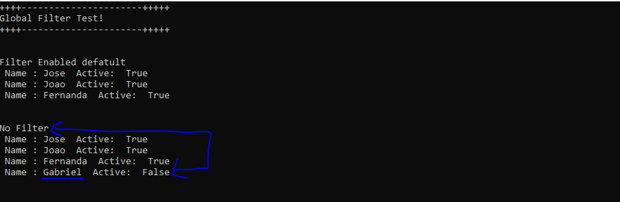

### Global Filters
Olá galera, vocês conhecem este recurso Global Query Filters ?, Ele nos permite especificar um filtro em nível do modelo e é aplicado automaticamente a todas as consultas que são executadas no contexto..

### Uso comum 
* Filtro padrão em linhas deletadas, inativas 
* Multi-tenancy - Aplicar filtro de multi-tenancy

#### Exemplo
Faça um clone no projeto, faça um Update-Database via PM, estou utilizando o LocalDB SQL 13.

### Via PM

```
 Update-Database

```


Output




### Limitação
* Não pode conter referências a propriedades de navegação
* Ele pode ser definido apenas na Entidade 
* O método IgnoreQueryFilters ignora todos os filtros (Global Filters) na entidade, ou seja, não podemos remover o filtro em especifico usando este método


### Summary
  Global Query Filter ou Model-Level Query Filter é um recurso incluido no Entity Framework, e pode ajudar a muitos programadores a não esqueçer de aplicar filtros
